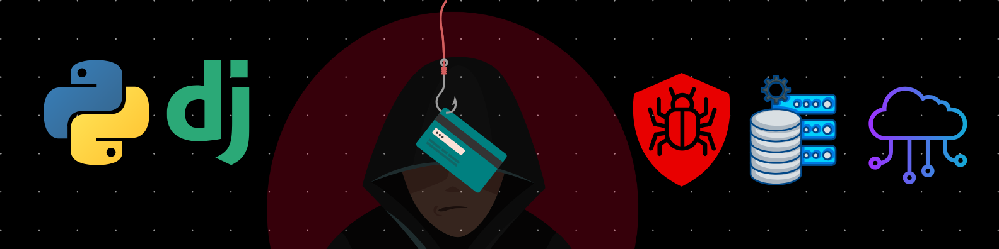

<h1 align="center">💫 Hi, I'm Awais Ali Shah</h1>
<h3 align="center">Python • Django • Backend • Security • DevOps</h3>

  <b>Building secure, scalable backend systems & APIs 🚀</b> 
  🇵🇰 Pakistan

---

## 🚀 About Me

I’m a **Python Django Backend Developer** with a strong passion for **REST APIs, database engineering, security testing, and scalable deployments**.

I love working at the intersection of **backend development + cybersecurity**, ensuring systems are not only fast and scalable — but **secure by design**.

- 🔭 **Currently working on**  
  Django & DRF-based backend systems, REST APIs, database optimization, Dockerized environments

- 🌱 **Currently learning**  
  Kubernetes, DevOps workflows, CI/CD pipelines, and cloud-native architectures

- 🤝 **Open to collaborate on**  
  Open-source Django projects, backend-heavy systems, security-focused applications

- 🙋‍♂️ **Looking for help with**  
  Advanced Kubernetes deployments & container orchestration

- 💬 **Ask me about**  
  Django, DRF, backend architecture, databases, pentesting, API security, deployment strategies

- ⚡ **Fun fact**  
  I enjoy breaking systems (ethically) just to make them stronger 🔐

---

## 🌐 Connect With Me

  
  
  
  

---

## 💻 Tech Stack

### 🧠 Backend & APIs

### 🗄️ Databases

### ☁️ DevOps & Cloud

### ⚙️ Tools & Platforms

### 🎨 UI / Visualization

---

## 📊 GitHub Analytics

  

  

  

## 🏆 Achievements

  

---

## ✍️ Dev Quote

  

---

## 🔝 Top Contributions

  

---

## 🐍 Contribution Snake

<picture>
  <source media="(prefers-color-scheme: dark)" 
    srcset="https://raw.githubusercontent.com/tobiasmeyhoefer/tobiasmeyhoefer/output/github-snake-dark.svg" />
  <source media="(prefers-color-scheme: light)" 
    srcset="https://raw.githubusercontent.com/tobiasmeyhoefer/tobiasmeyhoefer/output/github-snake.svg" />
  
</picture>

---

  

---

⭐ **If you like triggered learning, clean backend code & secure systems — feel free to follow!**  
